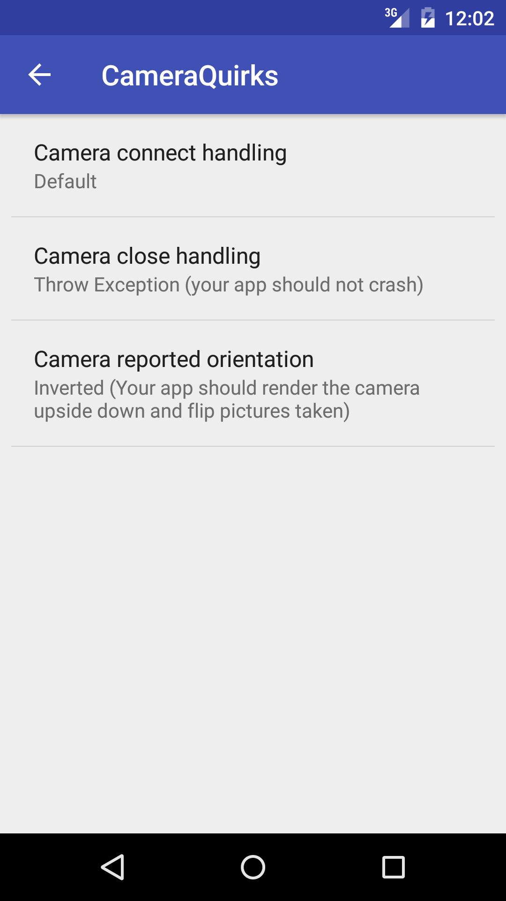

# Xposed-Camera-Quirks-Emulator
Debug options and Strict mode for camera app developers, using XPosed.
Supports any app using legacy camera or camera2 APIs.

Created for Droicon 2gether Hackathon with XDA.

## Usage
The functionality is provided as an XPosed module and configuration
tool to set options. Some options will break functionality for
your app, but all represent valid or observed behaviour, so should
be handled gracefully.

## Extending
Functionality is added via the Behaviour class. Implementations
 should be Enum, and provide methods for adding legacy camera
 and camera2 hooks. Values in shared prefs should match enum
 names for simpler construction.
